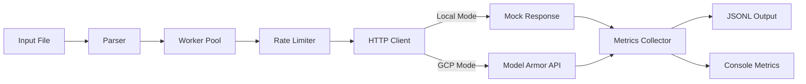
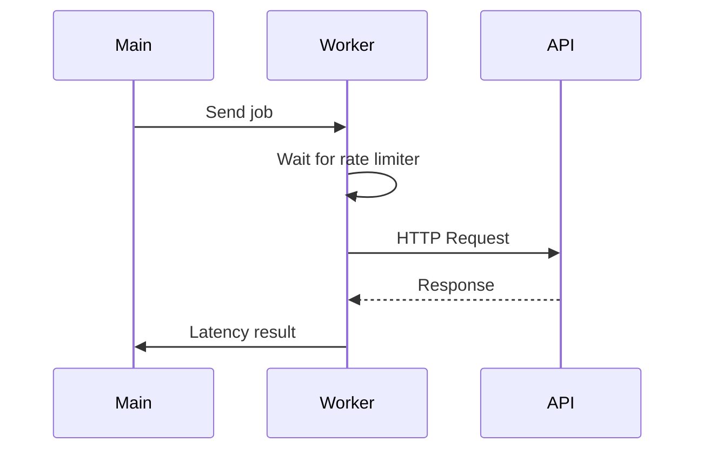

# Model Armor Batch Tester (Go)


## GitHub Setup

### Clone the Repository

```
git clone https://github.com/lislema/model-armor-batch.git
cd model-armor-batch
```

### Initialize

```
go mod tidy
```

---

## Build

```
go build -o model_armor_batch
```

---

## Run

### Local Mode

```
export LOCAL_MODE=true
./model_armor_batch input.txt output.jsonl
```

### GCP Mode

```
gcloud auth login
gcloud config set project <your-project-id>

unset LOCAL_MODE
export MODEL_ARMOR_TEMPLATE=<your-template>

./model_armor_batch input.txt output.jsonl
```

---

## Testing

```
go test -cover ./...
```

## Local Mode Explained

Local Mode runs fully offline using mocked responses.

- No API calls
- No authentication
- Deterministic execution

---

## GCP Mode Explained

GCP Mode executes real calls to Model Armor.

- Requires gcloud auth
- Uses real API
- Produces real metrics
- Subject to quotas and latency

---

## Summary

- Local Mode = system validation
- GCP Mode = real security + performance validation

## Architecture

### High-Level Flow (Mermaid)



---

### Worker Execution Model (Mermaid) 



---
